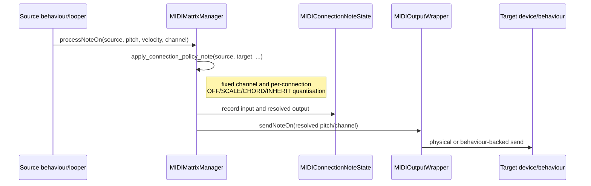
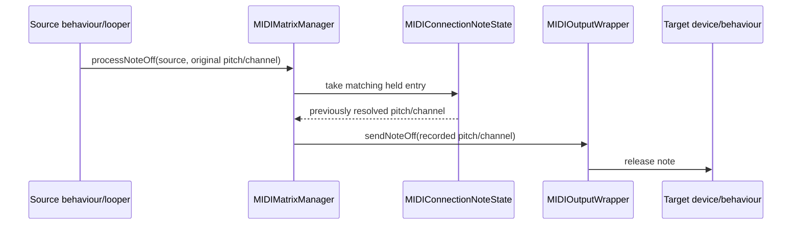
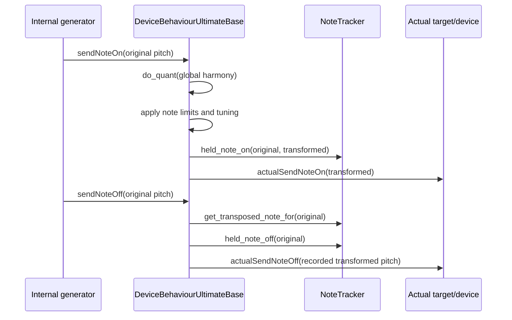

# MIDI note routing and quantisation

This document describes note ownership after quantisation became a per-connection policy.

## Two note paths

There are two distinct paths through `DeviceBehaviourUltimateBase`:

1. **Matrix-routed notes** originate at a registered matrix source and travel through a source-target connection. `MIDIMatrixManager` owns their dynamic quantisation and Note On/Off pairing.
2. **Behaviour-local notes** are sent directly by a behaviour, for example by an internal sequencer or chord generator. `DeviceBehaviourUltimateBase` owns their global quantisation and Note On/Off pairing.

These paths intentionally use different trackers. Removing either tracker would leave its path unable to release the pitch that was actually started after harmony changed.

## Matrix-routed Note On

Each occupied ledger entry represents one logical held Note On for one connection. It stores:

- source and target IDs;
- original input pitch/channel;
- resolved connection output pitch/channel;
- original velocity;
- whether the policy emitted or dropped the note.

A dropped note is still recorded because a harmony or policy change can make it valid while its key remains held.

## Matrix-routed Note Off

The connection policy is **not recalculated on ordinary Note Off**. Recalculating against current harmony was the source of stuck notes: the release could target a different pitch from the earlier Note On.

## Harmony or connection-policy change

`MIDIMatrixManager::migrate_connection_notes()` recalculates each affected held entry from its original input:

1. Compare the current recorded output with the output under the new harmony/policy.
2. Stop every changed old output.
3. Start every changed new valid output using the original velocity.
4. Update the ledger entry.

Stopping all changed notes before starting replacements keeps `MIDIOutputWrapper` pitch refcounts correct when several inputs collapse onto the same quantised pitch.

## Behaviour-backed targets

`MIDIOutputWrapper_Behaviour` calls `sendRoutedNoteOn()` and `sendRoutedNoteOff()` rather than ordinary behaviour sends.

The scoped routed-note dispatch depth exists so virtual behaviour logic still runs (for example polyphonic voice selection or arpeggiator trigger channels), while the base behaviour knows that connection quantisation and pairing have already been handled by the matrix. It is call-stack state, not held-note state: an RAII guard increments it before each synchronous routed delivery and restores it when that call returns. It does not wait for Note Off. In that context the base class:

- does not apply global harmony quantisation again;
- does not add the note to the behaviour-local `NoteTracker`;
- still applies target-local note limits and `TUNING_OFFSET`;
- sends through `actualSendNoteOn()` / `actualSendNoteOff()`.

The scope is restored after each routed call so later direct behaviour sends use the local path normally. Nested routed calls increase the depth and unwind correctly.

### Target-local transform changes

The matrix ledger records the value sent to the target wrapper. It does not observe the final pitch produced inside a behaviour target, including target note limits, `TUNING_OFFSET`, polyphonic voice allocation, and CV per-channel limits. Routed Note Off normally recomputes those target-local transforms symmetrically.

Behaviour note-limit setters and modulated effective-limit parameters explicitly migrate held notes. Before changing a limit, the manager snapshots each held route's resolved target pitch and channel without emitting anything. Afterwards it compares the new result and only releases or starts outputs whose resolved result changed. Notes valid at the same pitch and channel before and after are untouched. `TRANSPOSE` moves notes whose output changes into range, while `IGNORE` stops notes that are now out of range. The ledger entries remain occupied so the eventual source Note Off is still paired and consumed.

Connection-policy migration and target-transform migration use the same two-pass migration engine: all changed old outputs are released before any replacement outputs start. Connection-policy migration resolves from the original input and commits new connection pitch/channel values to the ledger. Target-transform migration compares a pre-change snapshot with the behaviour's current resolved output, emits directly at that target boundary, and leaves the connection-level ledger mapping unchanged.

Direct behaviour notes use the same comparison rule through the behaviour `NoteTracker`: unchanged mappings remain sounding, changed valid mappings are moved, and newly invalid mappings are stopped. Other mutable target-local transforms must use the same begin/end notification or provide their own migration.

## Behaviour-local notes

The behaviour `NoteTracker` remains necessary for this direct path. On a harmony change, `DeviceBehaviourUltimateBase::requantise_all_notes()` migrates these locally owned notes. Specialized behaviours such as the progression generator may override that method to regenerate semantic musical state instead.

## Ownership summary

| Concern | Owner |
|---|---|
| Per-connection quantise mode and fixed channel | `MIDIMatrixManager::connection_policies` |
| Routed input to resolved connection pitch/channel | `MIDIConnectionNoteState` |
| Routed output pitch refcounts shared by sources | `MIDIOutputWrapper::playing_notes` |
| Direct behaviour input to globally quantised pitch | `DeviceBehaviourUltimateBase::note_tracker` |
| Target-local limits, tuning, voice allocation | Target behaviour/output implementation |
| Harmony-change notification | `Conductor` |
| Routed harmony migration | `MIDIMatrixManager::migrate_connection_notes()` |
| Direct/specialized harmony migration | `DeviceBehaviourUltimateBase::requantise_all_notes()` and overrides |

## Panic behavior

Normal route cleanup uses recorded ledger outputs. Forced panic deliberately ignores known state: the manager discards relevant ledger entries without emitting their individual releases, then performs one raw Note Off sweep across every MIDI pitch on each relevant channel. This preserves the purpose of `force` without duplicating tracked Note Off events.
